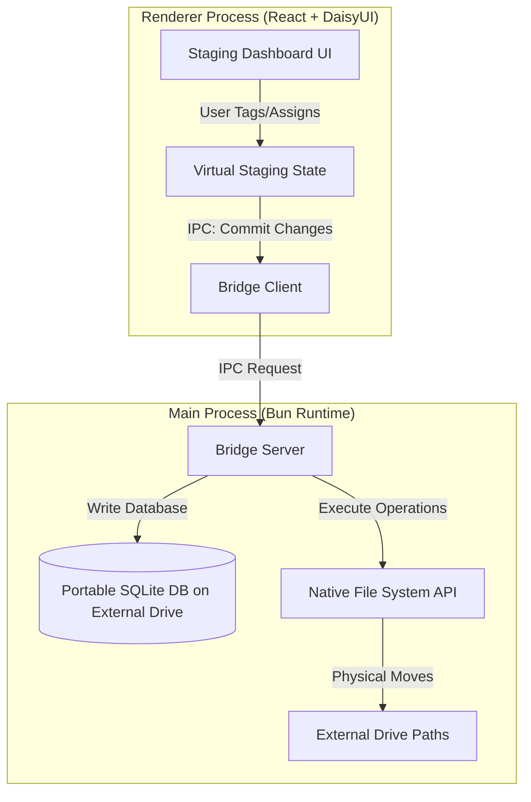
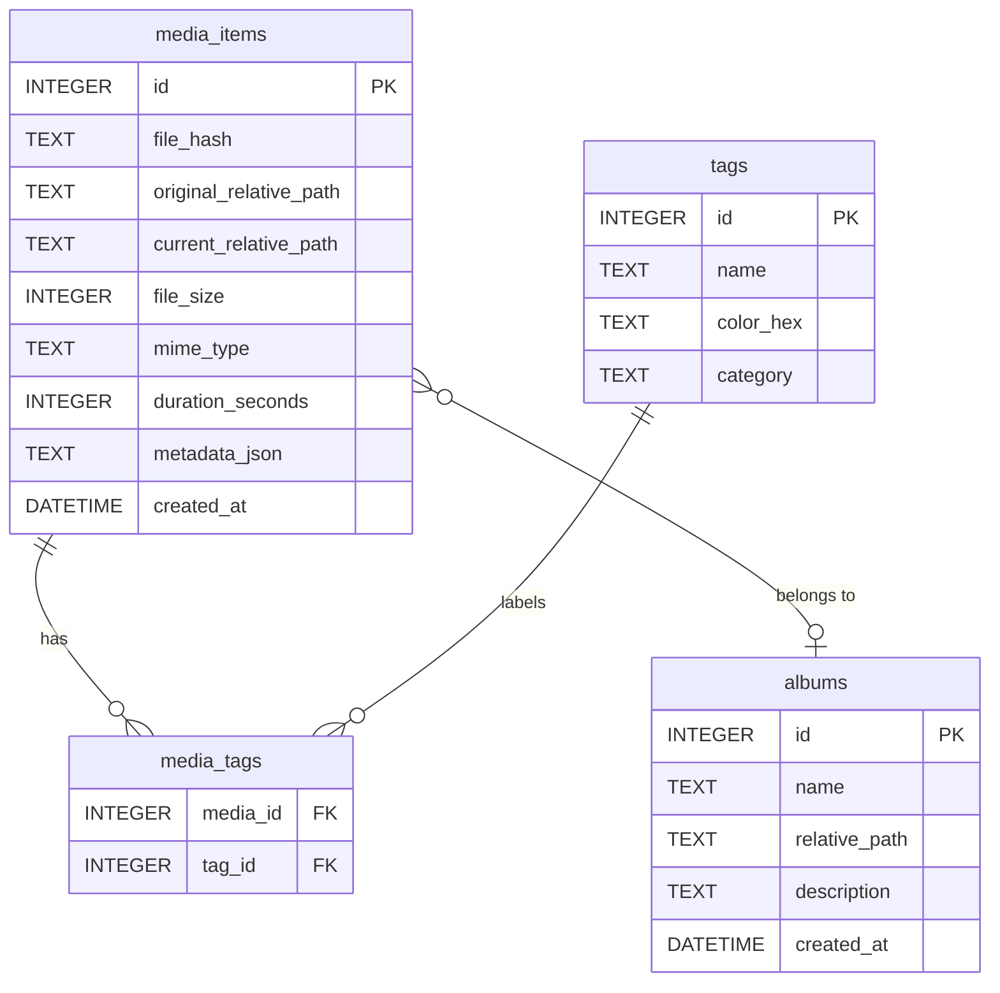

# Project Specification: External Drive Media Organizer

A native desktop application built on **Electrobun (React + Vite + Bun)** designed to inventory, tag, and physically organize high-volume media directly on external hard drives.

---

## 1. Product Overview & Core Principles

Unlike cloud-dependent media managers or host-locked photo libraries (like macOS Photos or Lightroom Catalog), this application is built specifically for **external drive portability and user control**:

1. **Portability (Database on Drive)**: The SQLite metadata database resides directly at the root folder of the media library on the external drive itself. This ensures that the tags, ratings, and album assignments travel with the physical drive.
2. **Explicit User Control (No Background Moves)**: File movements never occur automatically or in the background. The app operates in a "staging" model where the user organizes media virtually, and then clicks a manual "Consolidate & Execute" action to write changes to the disk.
3. **Structured Album Relocation**: Files assigned to albums are physically moved to dedicated subdirectories inside a main album folder.
4. **Fallback 'Unknown' Consolidation**: Any files introduced into the stager that are not assigned to a specific album are consolidated into a fallback `unknown/` subdirectory to clean up the rest of the drive.

---

## 2. System Architecture

The application leverages the **Electrobun dual-process isolation** model:



### 2.1 Technology Stack
- **Frontend Engine**: React 18 with TanStack Router, styled using Tailwind CSS and DaisyUI 5 (with high-end dark mode and glassmorphism styling).
- **Backend Runtime**: Bun 1.1+ (providing native file manipulation and `bun:sqlite`).
- **Database Engine**: SQLite (via Bun's native `bun:sqlite` C-bindings, yielding sub-millisecond query performance).
- **Process Communication**: Electrobun IPC RPC channel.

---

## 3. SQLite Database Schema

The SQLite database (`.media_library.db`) is initialized at the root of the designated media directory on the external drive.



### Schema Definition
```sql
-- Represents individual media files registered on the drive
CREATE TABLE IF NOT EXISTS media_items (
    id INTEGER PRIMARY KEY AUTOINCREMENT,
    file_hash TEXT NOT NULL,                  -- SHA-256 for duplicate detection
    original_relative_path TEXT NOT NULL,     -- Relative to library root
    current_relative_path TEXT NOT NULL,      -- Current relative path on drive
    file_size INTEGER NOT NULL,               -- Bytes
    mime_type TEXT NOT NULL,                  -- e.g., image/jpeg, video/mp4
    duration_seconds INTEGER DEFAULT NULL,    -- For video/audio assets
    metadata_json TEXT,                       -- EXIF, Camera Model, GPS details
    album_id INTEGER REFERENCES albums(id) ON DELETE SET NULL,
    created_at DATETIME DEFAULT CURRENT_TIMESTAMP
);

-- Album records mapping to physical directories
CREATE TABLE IF NOT EXISTS albums (
    id PRIMARY KEY AUTOINCREMENT,
    name TEXT UNIQUE NOT NULL,                -- Album/Folder name
    relative_path TEXT UNIQUE NOT NULL,       -- Path relative to library root
    description TEXT,
    created_at DATETIME DEFAULT CURRENT_TIMESTAMP
);

-- Tag categories for rapid filtering
CREATE TABLE IF NOT EXISTS tags (
    id INTEGER PRIMARY KEY AUTOINCREMENT,
    name TEXT UNIQUE NOT NULL,
    color_hex TEXT NOT NULL DEFAULT '#3B82F6', -- Accent display color
    category TEXT DEFAULT 'General'           -- Tag grouping (e.g., 'People', 'Event')
);

-- Junction table linking files and tags
CREATE TABLE IF NOT EXISTS media_tags (
    media_id INTEGER REFERENCES media_items(id) ON DELETE CASCADE,
    tag_id INTEGER REFERENCES tags(id) ON DELETE CASCADE,
    PRIMARY KEY (media_id, tag_id)
);
```

---

## 4. Physical Organization & Movement Logic

All physical organization operations are user-initiated and proceed through a transactional execution pipeline.

### 4.1 Folder Directory Structure on the External Drive
When the library is initialized at `/Volumes/ExternalDrive/MyMedia/`, the folder structure is formed:

```text
/Volumes/ExternalDrive/MyMedia/
├── .media_library.db          <-- SQLite database (hidden)
├── inbox/                     <-- Default directory for dumping new raw files
├── albums/                    <-- Main Album Directory
│   ├── Summer_2026/           <-- User-defined Album Subdirectory
│   │   ├── photo1.jpg
│   │   └── video1.mp4
│   ├── Family_Portrait/       <-- User-defined Album Subdirectory
│   └── unknown/               <-- Fallback folder for all unassigned stager items
│       ├── raw_unlabeled_1.png
│       └── clip_unlabeled_2.mov
```

### 4.2 The "Consolidate" Workflow (Moving Files)
When the user imports a batch of files from an staging directory (`inbox/` or custom scan path) to organize:

1. **Staging State**:
   - The files are listed in the app.
   - The user assigns specific files to albums (e.g. `Summer_2026`).
   - The remaining files in the list are left unassigned.
2. **Commit Action**:
   - The user clicks the **"Consolidate & Move Files"** button in the UI.
   - The Renderer process sends the staging batch instructions to the Bun Main Process.
3. **Execution Pipeline (Bun Main Process)**:
   - For each file in the batch:
     - **If assigned to an album**:
       - Target directory is `/albums/[Album_Name]/`.
       - Native file move is triggered: `fs.renameSync(source, target)`.
     - **If NOT assigned to any album**:
       - Target directory is `/albums/unknown/`.
       - Native file move is triggered: `fs.renameSync(source, target)`.
     - **Database Update**: The database `current_relative_path` is updated to reflect the new location.
   - If a file name collision occurs in the target directory:
     - Compute the SHA-256 hash of both files.
     - If the hashes match, delete/skip the redundant source file (de-duplication).
     - If the hashes differ, rename the incoming file (e.g., `filename_1.jpg`) and log the collision.

### 4.3 Scanner Directory & Path Ignorelist
During media discovery and cataloging, the scanner filters paths before recursion and file indexing:
1. **System-Level Built-in Skips**:
   - `albums/` (app library folder containing organized media and `.media_library.db`)
   - `node_modules/` and build output folders
   - Hidden files and folders starting with `.` (e.g. `.git`, `.Trash`, `.DS_Store`)
   - System volume folders like `lost+found`
2. **User-Configured Ignore Rules**:
   - Custom folder names (e.g., `temp`, `tmp`, `Archive`, `raw_dumps`)
   - Specific subpaths or relative path fragments (e.g. `exports/drafts`)
   - Rules are persisted across sessions in app settings (`settings_store`) and sent to the native Bun scanner via the RPC `startScan` channel.

---

## 5. UI/UX Interface Specification

The app features a custom glassmorphic theme designed to look beautiful and highly responsive.

### 5.1 Screens and User Flows

#### A. Library Setup & Drive Selector
- Prompts the user to select the root folder on the external hard drive.
- Verifies if `.media_library.db` exists. If not, prompts user to initialize a new library, creating the `albums/`, `albums/unknown/`, and database file.

#### B. Discover & Scanner Control Panel
- Lists all media catalog items registered in SQLite.
- Interactive **Folder & Path Ignorelist**:
  - Displays built-in system skips alongside customizable ignore tags.
  - Inline input and quick preset buttons (`+ temp`, `+ cache`, `+ raw`, `+ backups`, `+ archive`) to easily add ignore rules.
  - Delete badges (`✕`) and reset to default actions.
- Real-time scanner progress stats (Checked Files, Active Ignore Rules, SQLite Cataloged Count).

#### C. Tagging & Album Sidebar
- A multi-select grid allows users to batch-apply tags.
- Drag-and-drop or select-to-assign files to existing albums, or quickly create a new album subdirectory.

#### D. Review & Execution Panel
- A summary panel showing the pending operations:
  - `Move [124] items to /albums/Travel_2026/`
  - `Move [45] items to /albums/unknown/`
- Clicking **"Run Consolidation"** opens a progress modal showing progress bar, files being moved, and final write stats.

---

## 6. Safety & Resilience Protocols

Because physical file moves can be destructive if interrupted, the system implements:
- **Dry-run validation**: Before execution, tests permissions and checks if target directory space is available.
- **Rollback log**: Keeps a JSON transaction log in memory. If a file move fails halfway (e.g., drive unplugged), the app logs the failure to prevent database corruption.
- **Same-Drive Enforcement**: Relocations are constrained to the same storage volume using native renames, preventing slow and battery-draining copy-paste procedures over USB.
