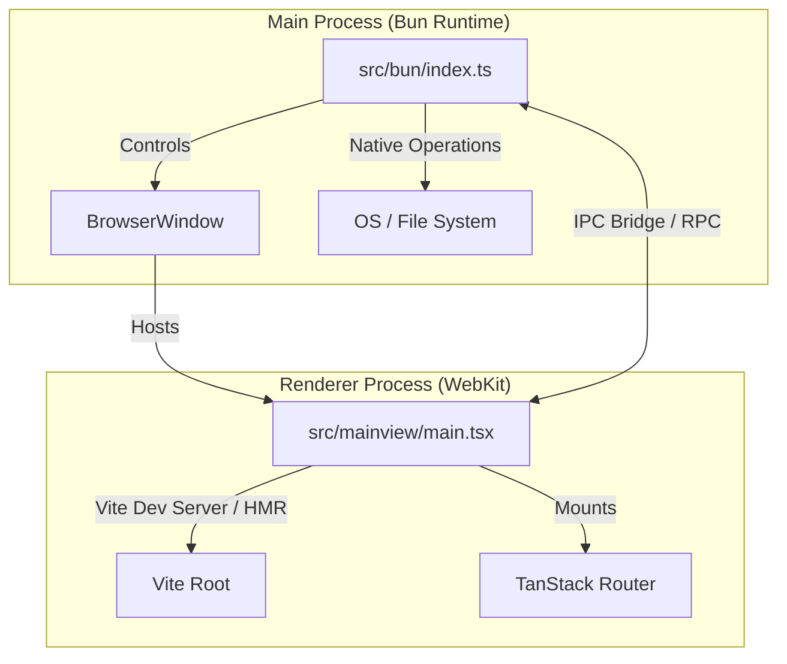

# Project Architecture & System Specifications

This document outlines the design, process isolation patterns, routing system, and tooling setup for the Electrobun React application.

---

## 1. System Architecture

The application is structured around a **Dual-Process Model** separating native operations from interface rendering:



### 1.1 Main Process (Native Shell)
- **Entrypoint**: `src/bun/index.ts`
- **Engine**: Runs on the native `Bun` runtime and communicates with system APIs via `Zig`.
- **Responsibilities**:
  - Main application window initialization via `BrowserWindow`.
  - Checking Vite Dev Server status to dynamically route HMR in development or static local HTML files in production.
  - Native menus, trays, updates, and secure OS-level file and thread integrations.

### 1.2 Renderer Process (Web UI)
- **Entrypoint**: `src/mainview/main.tsx`
- **Engine**: Rendered inside WebKit (via CEF/WebKit depending on OS).
- **Responsibilities**:
  - UI presentation and rendering using **React 18**, **Tailwind CSS v4**, and **DaisyUI v5**.
  - Local UI state management.
  - Client-side navigation routing.

---

## 2. Routing Integration (TanStack Router)

To support structured navigation, the renderer process employs **TanStack Router (v1)** with file-based routing compilation.

### 2.1 Configuration
Vite is configured to use `@tanstack/router-plugin` and `@tailwindcss/vite` inside `vite.config.ts`:
- **Routes Directory**: `src/mainview/routes/`
- **Generated Tree**: `src/mainview/routeTree.gen.ts`
- **Styling Architecture**: Zero-config JavaScript. Tailwind v4 and DaisyUI v5 are compiled directly from CSS directives (`@import` and `@plugin`) inside `src/mainview/index.css`.

### 2.2 Route Map
The files in the routes directory map directly to path endpoints:
*   `routes/__root.tsx`: Top-level shared layout containing the glassmorphic header, navigation bar, footer, and active link routing settings.
*   `routes/index.tsx`: The Dashboard Home view (`/`).
*   `routes/counter.tsx`: Interactive state demo route (`/counter`).
*   `routes/about.tsx`: System Info & Architecture route (`/about`).

---

## 3. Tooling and Development Workflow

### 3.1 Fast Typechecking with `tsgo`
Type verification uses **`tsgo`** instead of standard `tsc`. 
- **What is it**: `tsgo` is a native, Go-based preview version of the TypeScript compiler designed for high performance.
- **Benefit**: Type checks are performed up to 10x faster than traditional node-based processes, ensuring quick feedback in developer cycles.
- **Usage**: Run `bun run typecheck` which maps to `tsgo --noEmit`.

### 3.2 Hot Module Replacement (HMR)
To achieve fast local loops, run:
```bash
bun run dev:hmr
```
This spawns:
1.  **Vite Dev Server** (on port `5173`) to serve hot-reloaded react modules and bundle styles.
2.  **Electrobun watch utility** which boots the native window pointing to the Vite localhost URL, allowing frontend updates without restarting the container shell.
