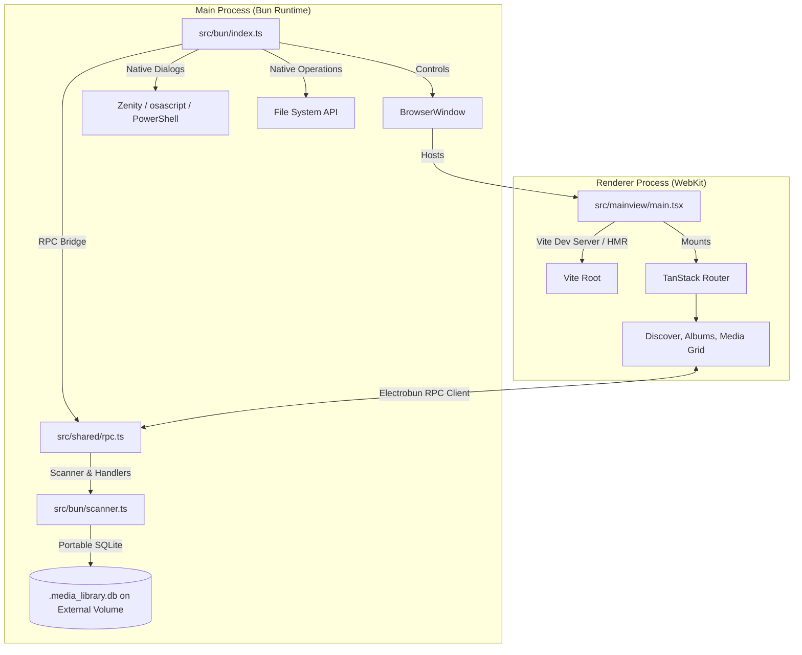

# Project Architecture & System Specifications

This document outlines the design, process isolation patterns, routing system, RPC bridge, native scanner engine, and tooling setup for the Electrobun React application.

---

## 1. System Architecture

The application is structured around a **Dual-Process Model** separating native Bun backend operations from WebKit UI rendering:



### 1.1 Main Process (Native Shell)
- **Entrypoint**: `src/bun/index.ts`
- **Engine**: Runs on the native `Bun` runtime and communicates with system APIs via `Zig` / native bindings.
- **Responsibilities**:
  - Main application window initialization via `BrowserWindow`.
  - Dynamic HMR dev server URL resolution (`http://localhost:5173`) vs production local static bundle.
  - Native file operations, SQLite database connections via `bun:sqlite`, and background thread management.
  - Cross-platform native folder and file selection dialog bridge (`selectFolder`).

### 1.2 Renderer Process (Web UI)
- **Entrypoint**: `src/mainview/main.tsx`
- **Engine**: Rendered inside WebKit.
- **Responsibilities**:
  - UI presentation using **React 18**, **Tailwind CSS v4**, and **DaisyUI v5**.
  - Global state management via **Zustand** (drives, settings, selection stores).
  - Client-side navigation and routing.

---

## 2. Routing Integration (TanStack Router)

The renderer process employs **TanStack Router (v1)** with file-based routing compilation.

### 2.1 Configuration
Vite is configured with `@tanstack/router-plugin` and `@tailwindcss/vite` inside `vite.config.ts`:
- **Routes Directory**: `src/mainview/routes/`
- **Generated Tree**: `src/mainview/routeTree.gen.ts`
- **Styling Architecture**: Zero-config JavaScript. Tailwind v4 and DaisyUI v5 compiled directly from CSS directives (`@import` and `@plugin`) in `src/mainview/index.css`.

### 2.2 Route Map
*   `routes/__root.tsx`: Top-level shared layout containing the glassmorphic sidebar, header, and drive selection context.
*   `routes/index.tsx`: Main Dashboard Home view (`/`).
*   `routes/discover.index.tsx`: Media Discovery & Folder Scanner with Ignorelist & Native Folder Picker (`/discover`).
*   `routes/medias.index.tsx`: Cataloged Media Grid with search, filtering, and sorting (`/medias`).
*   `routes/albums.index.tsx`: Album Collection Management (`/albums`).
*   `routes/album.$id.index.tsx`: Individual Album Media Inspector (`/album/$id`).
*   `routes/item.$id.index.tsx`: Detailed Media Asset Viewer (`/item/$id`).
*   `routes/settings.index.tsx`: Application Configuration & Cloud Backup settings (`/settings`).
*   `routes/about.tsx`: System Architecture & Info route (`/about`).
*   `routes/counter.tsx`: Interactive state demo route (`/counter`).

---

## 3. Native Scanner & Ignorelist Subsystem

### 3.1 Directory Walker
- Located in `src/bun/scanner.ts`.
- Uses an explicit directory stack (non-recursive) for memory safety during deep directory traversal.
- Indexes files directly into SQLite (`.media_library.db`) on the root of the targeted drive.

### 3.2 Ignorelist Engine
The scanner filters directories and file paths during discovery:
1. **Built-in System Skips**: `albums/`, `node_modules/`, `lost+found`, and hidden directories (`.*`).
2. **Custom Ignore Patterns**: User-configured folder names and subpath rules saved persistently in `useSettingsStore` and forwarded to the scanner via `rpc.request.startScan`.

### 3.3 Native File & Folder Dialog Bridge
- Located in `src/bun/handlers/misc.ts`.
- Implements `selectFolder` RPC request using OS native tools (`zenity`/`kdialog` on Linux, `osascript` on macOS, and PowerShell `FolderBrowserDialog` on Windows).
- Provides UI fallback to HTML `<input type="file" webkitdirectory />`.

---

## 4. Tooling and Development Workflow

### 4.1 Fast Typechecking with `tsgo`
Type verification uses **`tsgo`** instead of standard `tsc`. 
- **What is it**: `tsgo` is a native Go-based TypeScript type checker.
- **Usage**: Run `bun run typecheck` which maps to `tsgo --noEmit`.

### 4.2 Hot Module Replacement (HMR)
To run local development with HMR:
```bash
bun run dev:hmr
```
This spawns:
1. **Vite Dev Server** (on port `5173`) to serve hot-reloaded react modules and bundle styles.
2. **Electrobun watch container** which boots the native window pointing to Vite's dev server.
